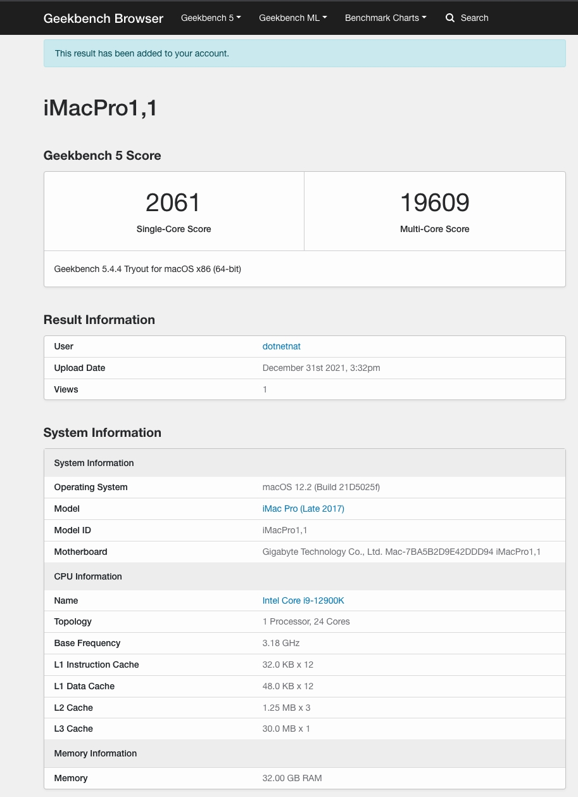
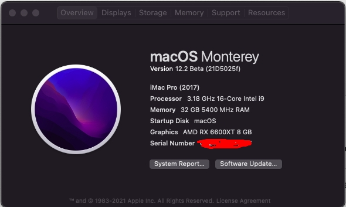
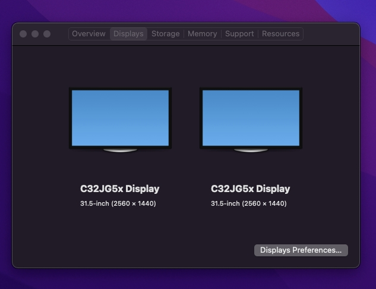
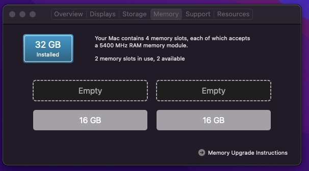

# z690-12900K-RX560-DDR5-Monterey
### Hardware
```
CPU : 12900K / OC PCore : 5.2
GPU : RX 560
M/B : Gigabyte Z690 Aorus Pro
RAM : 2 x Crucial 16GB Unbuffered DDR5 4800MHz CL40 DIMM / OC 5400
```

### Monterey
##### GeekBench 5
https://browser.geekbench.com/v5/cpu/11798216





### Not work
```
WIFI/BT
Audio
```
