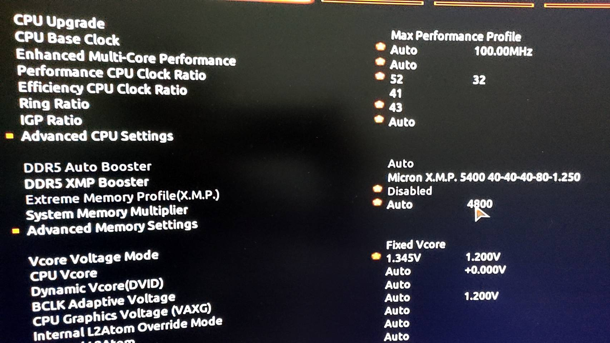

# z690-12900K-RX560-DDR5-Monterey
### Hardware
```
CPU : 12900K / OC PCore : 5.2 ECore : 4.1
GPU : Sapphire VGA NITRO+ RX 6600 XT
M/B : Gigabyte Z690 Aorus Pro
RAM : 2 x Crucial 16GB Unbuffered DDR5 4800MHz CL40 DIMM / OC 5400
```
### Add on
```
WIFI/BT : Fenvi FV-T919 1750Mbps
Audio : UGREEN USB Sound Card 30724
```

### OC


##### GeekBench 5
https://browser.geekbench.com/v5/cpu/11910605


### Monterey


